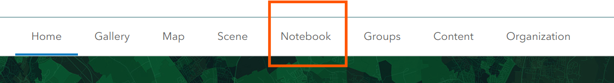

## 📘 ArcGIS Notebooks FAQ

### ❓ Turning on Notebooks

Before you can set up a notebook in ArcGIS Online, you need to make sure they are enabled on your server.  
[Click here for directions.](https://www.arcgis.com/home/item.html?id=db05d4f32e6145669e9d39f0ab258b67&rmedium=links_esri_com_0_a&rsource=https%3A%2F%2Flinks.esri.com%2Fagol-help%2Flesson%2Fenable-notebooks)

---

### ❓ Creating a New Notebook

> _Note: To do this, you MUST be an administrator on the site._

#### Step 1

Log into your ArcGIS Account. Select **Notebook** from the top menu bar.



If you do not see Notebook as an option, confirm that you are an administrator for that site. Only administrators can see the Notebook tools.

#### Step 2

Click **+New Notebook** and select `Standard`.


#### Step 3

Notebooks do **not save automatically**. Be sure to save often.

First, give your notebook a name by clicking **Save > Save As** on the right.


> _Give it a moment to save. I have found that saving and running things in notebooks always takes a tad longer than you think it should._

---

### ❓ Anatomy of a Notebook


> **Tip:** Use the **Run** and **File** buttons at the top to execute and manage your code.  
The initialization code is at the top of the Notebook in the first cell.  
Each box of code is a **cell**, and you can add new ones using the buttons at the bottom right of any cell.

---

### ❓ Initial Code

ArcGIS Notebooks use Python Code. Let’s add our code now.

In the first cell (box), you should already see some default lines of code. Delete them and add:

```python
import os
import pandas as pd
from collections import defaultdict
from arcgis.gis import GIS
from arcgis.gis import SharingLevel

gis = GIS("home")
```

#### 🔐 Data Security Note

Use:

```python
gis = GIS("home")
```

Do **NOT** use anything that asks for your username or password in the code.

---

### ❓ Kernels

**Kernels** are how ArcGIS Notebooks connect to your data.

The kernel can **"time out."** When that happens, you might see a pop-up like this:


Follow the directions — go to the Kernel menu and select **Reconnect**.  
Even though it looks scary, this is a **minor issue** and doesn’t break your code!

---

### ❓ Making Notes within the Code

It is _really_ useful to make notes as you write code.

Use the `#` symbol to create comments that explain your work.

For example:

```python
# Connect to ArcGIS Online
gis = GIS("home")

# Load data
data = pd.read_csv("mydata.csv")

# Display the first few rows
data.head()
```